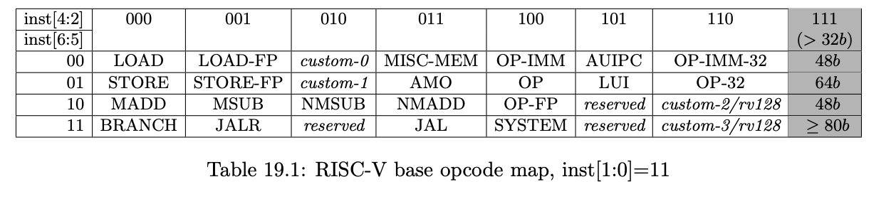

- [Adding custom opcode to compiler gcc 10](#adding-custom-opcode-to-compiler-gcc-10)
  - [Brief Encoding Overview:](#brief-encoding-overview)
- [Toolchain changes:](#toolchain-changes)
- [Instruction Validation Summary:](#instruction-validation-summary)
- [Adding custom instruction to RISC V gnu and simulating with spike](#adding-custom-instruction-to-risc-v-gnu-and-simulating-with-spike)
  - [Step 1 : Build RISCV gnu tools](#step-1--build-riscv-gnu-tools)
  - [Add custom instruction to opcode](#add-custom-instruction-to-opcode)
- [Write program and insert mod instruction](#write-program-and-insert-mod-instruction)
- [Install spike and proxy kernel](#install-spike-and-proxy-kernel)
  - [Run program](#run-program)

## Adding custom opcode to compiler gcc 10

Adding custom instructions compilation support, to RISCV toolchain.
RISCV ISA provides a robust set of instructions to fulfill most of the computing needs. But in some cases, The hardware designers may need to modify the core to carry out some additional operations.
And this ends up in the addition of new instructions in the existing ISA.

In such cases, the RISC-V toolchain is needed to be modified to provide compilation support for newly added instructions. In the next few sections, we’ll see how to do that.

In short, the process involves modifying gnu assembler(gas), such that the cross compiler generated from the toolchain
is able to recognize the newly added instructions.

Lets assume we add two new instructions

1. gcd rd,rs1,rs2
   Which computes the gcd of integers stored in source registers rs1 and rs2.
   And store the result in destination register rd

2. fact rd, <immediate>

- Which divides the value of immediate by 2 and then computes the factorial of result, and store it in memory address pointed by the address specified in rd. (It can be assumed that only even values are allowed in immediate)

[Note: GCD and factorial computations can be carried out sufficiently in existing RISCV ISA,
Both of these custom instructions are for illustration purposes only]

### Brief Encoding Overview:

Lets assume that the target ISA is for 32 bits (non-compressed).
So each instruction is 32 bits long.
The encoding rules specify where the identifiers of source and destination registers, Immediate values, and opcode are placed in those 32 bits.

Just to revise there are 32 general-purpose registers in rv32 ISA,
So log32 = 5 bits are required to uniquely identify each register.
Also, the rv32 ISA supports 12 and 20-bit immediate values.

1. Every 32-bit instruction should have the first two LSBs set to 1
That means last two bits of every 32 bit instruction are 11; `Bits[0,1]` = 11
`Bits[2–4]`, tell whether the instruction is long instruction (64 bit).
So for 32-bit instructions `Bits[2–4]` should never be 111.
The gcd instruction is an R- type instruction,

2. For R-type instruction The destination register is defined in bits from, bit 7 to bit 11, `Bits[7,11]` The first source register is defined in bits from, bit 15 to bit 19, `Bits[15,19]` second source register is defined in bits from, bit 20 to bit 24, `Bits[20,24]` `Bits[0,1]` = 11 (to specify that instruction is a 32 bit instruction) The rest of the Bits are used to store the opcode, such that `Bits[2,4]` should NOT be 111

3. The fact instruction is a J-type instruction.
For J-type instruction The destination register is defined in bits from, bit 7 to bit 11, `Bits[7,11]` Bit 12 to Bit 31 are used to store the 20-bit immediate value. The rest of the Bits are used to store the opcode, such that Bits[2,4] should NOT be 111

[The processors are designed to load the instruction and decode it by opcode
Identifying the type of instruction and location of the source and destination operands, And then generating suitable control signals to activate the circuits required to execute the instruction and store the results.]

## Toolchain changes:

In order to add two new instructions the first step is to modify
`riscv-gnu-toolchain/riscv-binutils/opcodes/riscv-opc.c` file.
This file contains all opcode or instruction definitions in an array riscv_opcodes, which is an array of riscv_opcode structure.

```c
const struct riscv_opcode riscv_opcodes[]
```

For adding a new instruction we need to add an entry in this array.

Before that let's take a look at riscv_opcode structure

```c
struct riscv_opcode
{
 /* The name of the instruction. */
 const char *name;
 /* The requirement of xlen for the instruction, 0 if no requirement. */
 unsigned xlen_requirement;
 /* Class to which this instruction belongs. Used to decide whether or
 not this instruction is legal in the current -march context. */
 enum riscv_insn_class insn_class;
 /* A string describing the arguments for this instruction. */
 const char *args;
 /* The basic opcode for the instruction. When assembling, this
 opcode is modified by the arguments to produce the actual opcode
 that is used. If pinfo is INSN_MACRO, then this is 0. */
 insn_t match;
 /* If pinfo is not INSN_MACRO, then this is a bit mask for the
 relevant portions of the opcode when disassembling. If the
 actual opcode anded with the match field equals the opcode field,
 then we have found the correct instruction. If pinfo is
 INSN_MACRO, then this field is the macro identifier. */
 insn_t mask;
 /* A function to determine if a word corresponds to this instruction.
 Usually, this computes ((word & mask) == match). */
 int (*match_func) (const struct riscv_opcode *op, insn_t word);
 /* For a macro, this is INSN_MACRO. Otherwise, it is a collection
 of bits describing the instruction, notably any relevant hazard
 information. */
 unsigned long pinfo;
};
```

So the entries added to riscv_opcode arrays for the new instructions will be as follows

```c
{"gcd", 0,  INSN_CLASS_I,"d,s,t",MATCH_GCD,MASK_GCD,match_opcode,0}
{"fact",0,  INSN_CLASS_I,"d,a",MATCH_FACT,MASK_FACT,match_opcode,0}
A brief description of each value is given below.
```

| Name                                                                                                                                                                        | Description                                                                                                                                                                                                                                                                                                                                                                                                                               |
| --------------------------------------------------------------------------------------------------------------------------------------------------------------------------- | ----------------------------------------------------------------------------------------------------------------------------------------------------------------------------------------------------------------------------------------------------------------------------------------------------------------------------------------------------------------------------------------------------------------------------------------- |
| name                                                                                                                                                                        | will be `gcd` and `fact` for the gcd and factorial instructions respectively.                                                                                                                                                                                                                                                                                                                                                             |
| xlen                                                                                                                                                                        | can have values 0,32 or 64. It is used to specify whether the instruction is targeted for only 32 or 64-bit RISCV variants. It seems if this value is set to 32 the instruction will work with only 32-bit variant, And if the value is 64 the instruction will work only on 64-bit version. And if the xlen value is set to 0 then the instruction will work on both 32 and 64-bit variants. For both instructions, this value will be 0 |
| insn_class                                                                                                                                                                  | Described the class of instruction, whether it is an integer, atomic, compressed                                                                                                                                                                                                                                                                                                                                                          |
| \*args                                                                                                                                                                      | Is string to specify the operands/register involved in the instruction.For gcd instruction args = “d,s,t” for fact instruction args = `d,a` `d` is for destination `s` is for source register 1. `t` is for source register 2. `a` is for 20 bit immediate.How these characters will be utilized will become more clear in the Validation section.                                                                                        |
|  |
| match:                                                                                                                                                                      | It is the basic instruction opcode provided Initially. This opcode is later modified during assembling. The modification involves the placement of identifiers for operand registers and other information in the opcode.                                                                                                                                                                                                                 |
| mask | Mask is used to identify the position of operand bits in the instruction, ith bit in Mask is 1 if it is not used as an operand in the instruction, Otherwise it is 0. |
| opcode                                                                                                                                                                      | The instruction opcode specification struct also requires a pointer to function, which will be used to detect if any instruction matches with given instruction. The function is given below.                                                                                                                                                                                                                                             |

```c
static int
 match_opcode (const struct riscv_opcode *op, insn_t insn)
 {
 return ((insn ^ op->match) & op->mask) == 0;
 }
 [from riscv-binutils/opcodes/riscv-opc.c]
```

1. pinfo is used to describe the instruction by binary codes. Like there are codes for conditional, jump type, data movement instructions.
   We wont be describing the instruction so this will be 0

In File `riscv-gnu-toolchain/riscv-binutils/include/opcode/riscv-opc.h` match and mask codes for the instruction are added
Using the rules described above

```c
#define MATCH_GCD 0x6027
#define MASK_GCD 0xfe00707f
#define MATCH_FACT 0x27
#define MASK_FACT 0x7f
DECLARE_INSN(gcd, MATCH_GCD,MASK_GCD)
DECLARE_INSN(fact, MATCH_FACT,MASK_FACT)
optinally same changes can be done in
riscv-gnu-toolchain/riscv-gdb/opcodes/riscv-opc.c
riscv-gnu-toolchain/riscv-gdb/include/opcode/riscv-opc.h
```

## Instruction Validation Summary:

Instruction defined in the riscv-opc.c are validated during assembler building process. Instruction validation logic can be found in “validate_riscv_insn” function in file riscv-gnu-toolchain/riscv-binutils/gas/config/tc-riscv.c

1. The validation process starts with detecting the size of the instruction
   be checking the last two bits defined in opc->match

2. Based on the size of bits total number of required bits is computed
   For these instruction it will be 2³¹ -1 or 0xFFFFFFFF;

3. Variable used_bits is set to the initial mask code of the instruction
   Defined in opc->mask. So used bits initially have all the operand bits
   set to 0 and all then non-operand bits set to 1.

4. After instruction size validation is done.
   The args string (opc->args, which is stored in variable p), is parsed.
   Every character in args string corresponds to an operand.
   For each character and shift and mask value is defined and the bits in the Variable “used_bits” are set for the given mask and shift value as follows

```c
used_bits |= ((insn_t)(mask) << (shift))
```

Example if the instruction uses a destination register, then its args string will have character “d”, for “d”, mask is 1xf and shift is 7. So this will set bits 7 to 11 of used bits.

- Step 4 is repeated for all the characters in the args string.

- If the final results have all the bits in used_bits equal to 1, i.e
  used_bits = required_bits
  Then the instruction definition is considered valid.

After making the toolchain changes specified above, the toolchain can be rebuilt to support newly added instructions

A test program

```c
#include <stdint.h>
#define FACT_DIGITS 10000
int main(void)
{
uint32_t num1 = 2321, num2 = 1771731, gcd = 0;
uint32_t fact_test_val = 10;
uint32_t fact_result_ptr;
uint8_t fact_result[FACT_DIGITS];
fact_result_ptr = (uint32_t)fact_result;
asm volatile("gcd %0, %1,%2\n":"=r"(gcd):"r"(num1),"r"(num2):);
//suppose we want to compute the factorial of 125 so immediate=250
asm volatile("fact %0, %1\n":"=r"(fact_result_ptr):"i"(250):);
return 0;
}
```

Generated assembly code from the output elf file

```nasm
0001013c <main>:
   1013c: 8c010113           addi sp,sp,-1856
   10140: 72812e23           sw s0,1852(sp)
   10144: 74010413           addi s0,sp,1856
   10148: ffffe2b7           lui t0,0xffffe
   1014c: 00510133           add sp,sp,t0
   10150: 000017b7           lui a5,0x1
   10154: 91178793           addi a5,a5,-1775 # 911 <register_fini-0xf763>
   10158: fef42623           sw a5,-20(s0)
   1015c: 001b17b7           lui a5,0x1b1
   10160: 8d378793           addi a5,a5,-1837 # 1b08d3 <__global_pointer$+0x19eafb>
   10164: fef42423           sw a5,-24(s0)
   10168: fe042223           sw zero,-28(s0)
   1016c: 00a00793           li a5,10
   10170: fef42023           sw a5,-32(s0)
   10174: ffffe7b7           lui a5,0xffffe
   10178: 8dc78793           addi a5,a5,-1828 # ffffd8dc <__global_pointer$+0xfffebb04>
   1017c: ff078793           addi a5,a5,-16
   10180: 008787b3           add a5,a5,s0
   10184: fcf42e23           sw a5,-36(s0)
   10188: fec42783           lw a5,-20(s0)
   1018c: fe842703           lw a4,-24(s0)
   10190: 00e7e7a7           gcd a5,a5,a4
   10194: fef42223           sw a5,-28(s0)
   10198: f63ef7a7           fact a5,fa <register_fini-0xff7a>
   1019c: fcf42e23           sw a5,-36(s0)
   101a0: 00000793           li a5,0
   101a4: 00078513           mv a0,a5
   101a8: 000022b7           lui t0,0x2
   101ac: 00510133           add sp,sp,t0
   101b0: 73c12403           lw s0,1852(sp)
   101b4: 74010113           addi sp,sp,1856
   101b8: 00008067           ret
```

Instructions at address `0x10190` and `0x10198` contains newly added custom instructions

---

Prior to gcc 10

- [Adding custom opcode to compiler gcc 10](#adding-custom-opcode-to-compiler-gcc-10)
  - [Brief Encoding Overview:](#brief-encoding-overview)
- [Toolchain changes:](#toolchain-changes)
- [Instruction Validation Summary:](#instruction-validation-summary)
- [Adding custom instruction to RISC V gnu and simulating with spike](#adding-custom-instruction-to-risc-v-gnu-and-simulating-with-spike)
  - [Step 1 : Build RISCV gnu tools](#step-1--build-riscv-gnu-tools)
  - [Add custom instruction to opcode](#add-custom-instruction-to-opcode)
- [Write program and insert mod instruction](#write-program-and-insert-mod-instruction)
- [Install spike and proxy kernel](#install-spike-and-proxy-kernel)
  - [Run program](#run-program)

## Adding custom instruction to RISC V gnu and simulating with spike

### Step 1 : Build RISCV gnu tools

```bash
git clone --recursive https://github.com/riscv/riscv-gnu-toolchain
export RISCV=/path/to/install/riscv/toolchain
./configure --prefix=/opt/riscv
make -j `getconf _NPROCESSORS_ONLN` newlib
make install
```

### Add custom instruction to opcode

A set of python scripts that will generate C headers to be added to gcc/gdb and Chisel toolchains.

```
git clone https://github.com/riscv/riscv-opcodes
cd riscv-opcodes.
```

Open the file riscv-opcodes/opcodes, here you will be able to see the various opcodes and instruction bits assigned to various instructions. Assigned an unused instruction to modulo inst.

- You need to set the bits 6:0 in the custom-0 and custom-1 range. **Here we actually violate the rules. Because, why not ?**. If you violate you might not be compatible with future iterations of RISC-V
- Specify the types and fields. Here we use R-type to say what fields are used as it is.
  

```bash
mod     rd rs1 rs2 31..25=1  14..12=0 6..2=0x1A 1..0=3
# Hence the overall encoding is 0000001 rs2 rs1 000 rd 1A3
```

- Generate the opcode

```bash
cat opcode-mod | ./parse_opcodes -c > temp.h
```

- Copy header to gnu toolchain

```c
#define MATCH_MOD 0x200006b
#define MASK_MOD 0xfe00707f
DECLARE_INSN(mod, MATCH_MOD, MASK_MOD)
```

```c
riscv-binutils/include/opcode/riscv-opc.h
riscv-binutils/include/opcode/riscv-opc.h
diff riscv-binutils/include/opcode/riscv-opc.h riscv-binutils/include/opcode/riscv-opc.h
# these files should be identical
```

- Add entry to implementation

  ```c
  {"mod",         0, INSN_CLASS_I,   "d,s,t",  MATCH_MOD, MASK_MOD, match_opcode, 0 },
  ```

- Add this entry either as the last or first entry.

```
riscv-gdb/opcodes/riscv-opc.c
riscv-gdb/opcodes/riscv-opc.c
```

- Rebuild

```bash
make -j `getconf _NPROCESSORS_ONLN`
make install
```

## Write program and insert mod instruction

```
export RISCV=/path/to/toolchain
export PATH=$RISCV/bin:$PATH
```

```
riscv64-unknown-elf-gcc mod.c -o mod
riscv64-unknown-elf-objdump -dC mod | grep mod
```

## Install spike and proxy kernel

- Build spike (instruction set simulator for RISC V)

```
git clone ssh://git@github.com/riscv/riscv-isa-sim.git
cd riscv-isa-sim
mkdir build
cd build
../configure --prefix=$RISCV
make -j `getconf _NPROCESSORS_ONLN`; make install
```

- Build pk (proxy kernel for RISC V)

```
git clone ssh://git@github.com/riscv/riscv-pk.git
mkdir build
cd build
../configure --prefix=$RISCV --host=riscv64-unknown-elf
make -j `getconf _NPROCESSORS_ONLN`; make install

```

- Step 1. Add the decoding information. In the `riscv-isa-sim/riscv/encoding.h` add the following lines:

```C
#define MATCH_MOD 0x200006b
#define MASK_MOD 0xfe00707f
...
DECLARE_INSN(mod, MATCH_MOD, MASK_MOD)
```

- Step 2. Add the functional emulation
  Create a file riscv-isa-sim/riscv/insns/mod.h and add these lines:

```C
WRITE_RD(sext_xlen(RS1 % RS2));
```

Add this file to `riscv-isa-sim/riscv/riscv.mk.in`

```Makefile
riscv_insn_list = \
      ...
      mod \
      ...
```

In `riscv-isa-sim/spike_main/disasm.cc` add the following lines:

```C
DEFINE_RTYPE(mod);
```

And now build riscv-tools again. The “mod” instruction has been added to spike simulator

### Run program

```bash
spike pk mod
```
